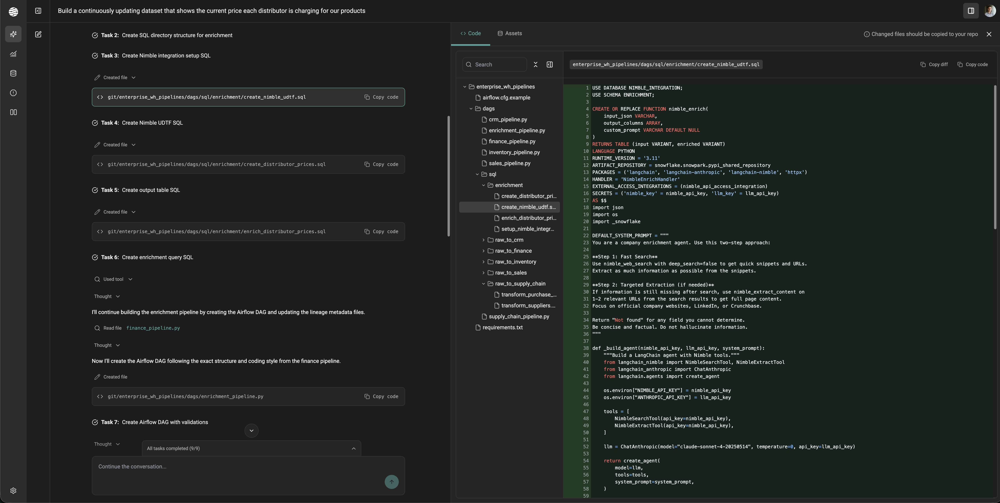

# Real-Time Data Enrichment with Nimble Agents

Build AI-powered data enrichment pipelines that bring live web data into your data warehouse using [Upriver's](https://upriverdata.com) Autonomous Data Engineer [Nimble's](https://nimbleway.com) search and extraction tools, powered by LangChain agents.

This repository provides everything you need to deploy a **Nimble enrichment function** in your data warehouse and call it from SQL. An AI agent uses Nimble's Web Search and Content Extraction APIs to find and return structured data for any entity — products, companies, people, or anything else on the web.

> **Companion blog post:** [Building Real-Time Pricing Intelligence in Snowflake with Upriver + Nimble](https://upriverdata.com/blog/pricing-intelligence-nimble)



---

## How It Works

```
┌─────────────────┐      ┌──────────────────┐      ┌─────────────────┐
│  Your Warehouse │      │  LangChain Agent │      │   Nimble API    │
│  (Snowflake /   │─────▶│  (Claude + tools)│─────▶│  Search &       │
│   Databricks)   │      │                  │      │  Extract        │
│                 │◀─────│  Parses & returns│◀─────│  Live web data  │
│  nimble_enrich()│      │  structured JSON │      │                 │
└─────────────────┘      └──────────────────┘      └─────────────────┘
```

The enrichment function (`nimble_enrich`) is a generic UDTF/UDF that accepts:

| Parameter | Description |
|---|---|
| `input_json` | JSON object describing the entity (e.g., `{"product_name": "Dyson V15", "website": "bestbuy.com"}`) |
| `output_columns` | Array of fields you want enriched (e.g., `["price", "discount", "url"]`) |
| `custom_prompt` | *(Optional)* Custom system prompt to specialize the agent's behavior |

The agent autonomously decides whether to search, which URLs to extract, and how to assemble the final answer.

---

## Repository Structure

```
├── snowflake/                        # Snowflake UDTF setup & usage
│   ├── README.md
│   ├── 01_setup.sql                  # Network rules, secrets, integration
│   ├── 02_create_udtf.sql            # The nimble_enrich() UDTF
│   └── 03_example_usage.sql          # Example enrichment queries
│
├── databricks/                       # Databricks UDF setup & usage
│   ├── README.md
│   ├── 01_setup_and_udf.ipynb        # Notebook: install deps + register UDF
│   ├── 01_setup_and_udf.py           # Same as above in plain Python
│   ├── 02_example_usage.ipynb        # Notebook: example enrichment queries
│   └── 02_example_usage.py           # Same as above in plain Python
│
├── pricing-pipeline-demo/            # Code from the Nimble UDF demo video
│   ├── README.md                     # Demo overview + video link
│   ├── images/                       # Screenshots and demo video
│   └── pipelines/                    # Airflow DAGs + SQL for enrichment
│
└── README.md                         # This file
```

---

## Quick Start

### Prerequisites

- **Nimble API key** — [Get one here](https://app.nimbleway.com/account_settings/api_keys)
- **Anthropic API key** (for Snowflake) or **Databricks Model Serving endpoint** (for Databricks)

### Snowflake

```sql
-- 1. Run the setup script (replace API key placeholders)
-- 2. Create the UDTF
-- 3. Enrich any table:

SELECT
    e.input:company_name::STRING AS company_name,
    e.enriched:ceo::STRING AS ceo,
    e.enriched:founded::STRING AS founded
FROM my_companies t,
     TABLE(NIMBLE_INTEGRATION.ENRICHMENT.nimble_enrich(
         TO_JSON(OBJECT_CONSTRUCT('company_name', t.name, 'website', t.domain)),
         ARRAY_CONSTRUCT('ceo', 'founded', 'headquarters')
     ) OVER (PARTITION BY 1)) e;
```

### Databricks

```python
# 1. Run the setup notebook to install deps and register the UDF
# 2. Enrich any table:

result = nimble_enrich(
    '{"product_name": "Dyson V15", "website_domain": "bestbuy.com"}',
    '["price", "discount", "url"]'
)
```

See the platform-specific READMEs in [`snowflake/`](snowflake/) and [`databricks/`](databricks/) for detailed setup instructions.

---

## The Pricing Pipeline Demo

The [`pricing-pipeline-demo/`](pricing-pipeline-demo/) folder contains the **exact code** shown in the Nimble UDF demo video. It's a complete, runnable example that demonstrates the full pipeline:

1. **Starting state** — A simulated enterprise warehouse with 14 tables across 5 schemas (inventory, sales, CRM, supply chain, finance)
2. **The pipeline** — Cross-joins SKUs × Distributors and calls `nimble_enrich()` to fetch live pricing from each retailer's website
3. **The result** — An enriched `DISTRIBUTOR_PRICES` table with real-time prices, discounts, deviation from MSRP, and listing URLs

See the [demo README](pricing-pipeline-demo/README.md) for the video walkthrough and file-by-file breakdown.

---

## About

Built by [Upriver](https://upriverdata.com) and [Nimble](https://nimbleway.com).

- **Upriver** — AI-powered data pipeline builder that understands your warehouse and autonomously constructs enrichment pipelines
- **Nimble** — Real-time web data API providing search, extraction, and structured web intelligence

## License

Apache 2.0
